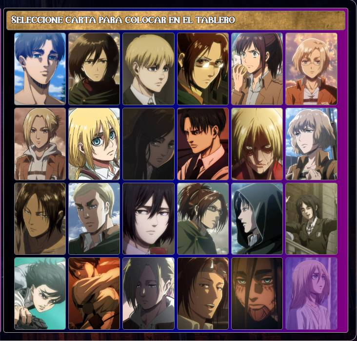
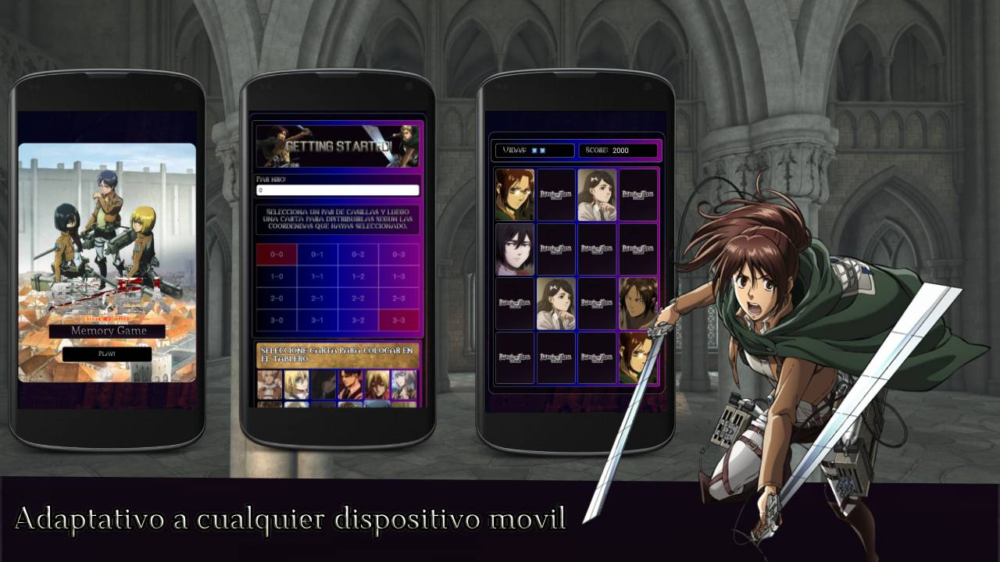
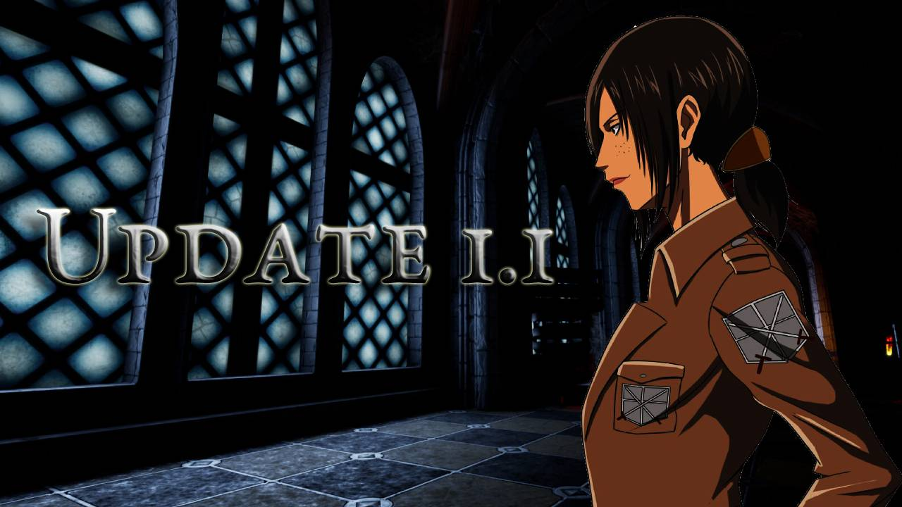

# Attack-on-Titan-Memory-Card-Game
<h1 align="center">Attack on Titan Memory Game</h1>

  

Este es un juego de cartas de memoria inspirado en Attack on Titan, desarrollado con JavaScript, HTML y CSS. El objetivo es encontrar todos los pares de cartas correctos para ganar la partida.
 <h3>Cómo jugar</h3>
<ol>
  <li>Haz clic en dos cartas para voltearlas.</li>
  <li>Encuentra las parejas correctas para eliminarlas del tablero.</li>
  <li>Gana cuando todas las parejas hayan sido descubiertas.</li>
</ol>

  

  <figcaption>Entrada principal del juego</figcaption>

  

   Seccion donde se seleccionara una unica carta para luego distribuirla en dos casillas del tablero.

<h2>Update 1.1</h2>

En esta nueva actualizacion se ha implementado la opcion de que el jugador pueda jugar una partida de forma automatica sin tener que armar el juego de forma manual, lo cual esta ultima se mantiene en la opcion de 'partida personalizada'

Pruebalo aqui: https://attack-on-titan-memory-game.netlify.app/ 

