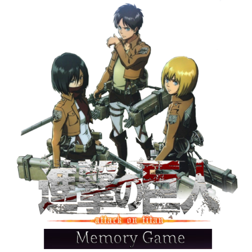
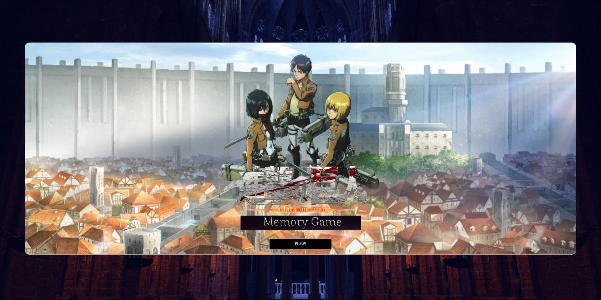
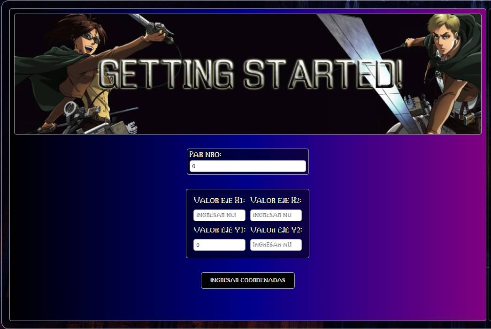

# Attack-on-Titan-Memory-Card-Game
<h1 align="center">Attack on Titan Memory Game(En desarrollo) </h1>

  

Este es un juego de cartas de memoria inspirado en Attack on Titan, desarrollado con JavaScript, HTML y CSS. El objetivo es encontrar todos los pares de cartas correctos para ganar la partida.
 <h3>Cómo jugar</h3>
<ol>
  <li>Haz clic en dos cartas para voltearlas.</li>
  <li>Encuentra las parejas correctas para eliminarlas del tablero.</li>
  <li>Gana cuando todas las parejas hayan sido descubiertas.</li>
</ol>

  

  <figcaption>Entrada principal del juego</figcaption>

  

   Seccion donde se ingresan los valores de las coordendas para ingresar las cartas. Se evalua cambiar esta forma de ingresar las coordendas.

